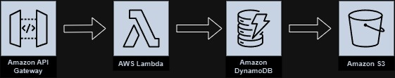

# Weather-Data-Logger-AWS
## Project Overview
This Project is a serverless application designed to log weather data at regular intervals using AWS services and display it on a static website. This project collects weather information (such as temperature and description) from the OpenWeatherMap API, stores it in DynamoDB, and allows users to view the data through a web interface hosted on Amazon S3. The project demonstrates AWS serverless capabilities and efficient data handling using AWS Lambda, API Gateway, DynamoDB, and S3, keeping within the free-tier limits. 
## Key Functionalities
1. Weather Data Collection:
   - Fetches real-time weather data from the OpenWeatherMap API for a specific city (e.g., London).
   - The fetched data includes temperature and weather description, stored with a timestamp.
2. Data Storage and Logging:
   - Stores the weather data in DynamoDB table with the date and time as primary keys to keep entries unique.
   - Automated logging at regular intervals using EventBridge and CloudWatch to trigger Lambda for data collection.
3. Data visualization:
   - Presents logged weather data on a public static website hosted on S3.
   - JavaScript in the HTML file fetches data from the API Gateway endpoint to display on the website in real-time. 
## Architecture
The Project uses a serverless architecture for scalability, efficiency, and cost-effectiveness. Below is the break-down of each component:
  - API Gateway: Acts as a front-end entry point for API requests, integrating with Lambda to process POST requests and invoke weather data logging.
  - AWS Lambda: The function that pulls data from OpenWeatherMap API, processes it, and stores it in DynamoDB.
  - Amazon DynamoDB: Serves as a NoSQL database to store weather data in a structured format with date and time keys.
  - EventBridge / CloudWatch: Configured to trigger the Lambda function every hour to automate data fetching and logging. 
### Data Flow Architecture Diagram

## Testing
You can test the API Gateway endpoint using the provided Postman collection
   - Import the Postman collection file attached in the 'Testing/' folder.
   - Adjust the endpoint URL as needed
   - Run the "Log Weather Data" request to trigger the Lambda function and log data in DynamoDB.
## Sample Data
   - A 'Sample_data.json' file is provided in the 'sample_data/' folder to demonstrate the structure of data logged in DynamoDB. 
   - This sample data shows typical entries for weather data, including 'date', 'time', 'temperature', and 'description'.
## Challenges 
1. API Rate Limiting:
   - Free API keys often have usage limit, so configure the Lambda function frequency to stay within these limits.
2. Error Handling:
   - Handling failed API calls or network issues in Lambda can be challenging. Implementing retry mechanisms helps mitigate these issues.
3. Cost Management:
   - AWS free-tier limits can be exceeded if resources aren't monitored carefully. Billing alerts help keep track of usage.
4. Security:
   - Storing API keys securely and configuring proper IAM roles for each service reduces security risks. 
